## H5_Project的开发(嘉利公关，中国前三的传媒公关公司)

* 公司主要为美的集团，江中集团，康佳集团，旺旺集团，顺丰优选，维他奶，奔驰宝马等各大客户提供技术服务，是中国广州的老牌上市公司。具有一定雄厚的技术背景。该仓库主要展示我在公司2018-2019年来做的比较典型的H5。其中设计的到技术有人脸识别（利用百度人工智能接口），省市互联系统为云度提供春节接送服务，canvas照片文字合成和签名作画功能，抽奖功能，分页功能以及其他很多我差不多忘了的功能，哈哈哈。

### 公司已上线的h5项目源码（切勿用作商业用途，发现必究）
需要获取用户信息的H5需要自己配置自己的微信信息以及数据库信息

#### 因为涉及商业机密和企业安全，所有请求数据的信息接口已删除，请自己模拟接口数据

### 项目扫码体验

**1、康佳_人脸识别**

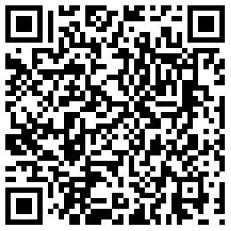

**2、众泰_征战洞庭湖**

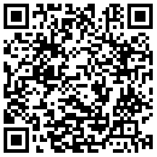

**3、云度_春节接你回家**

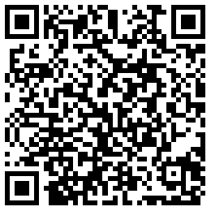

**4、康佳_百万签名征集**

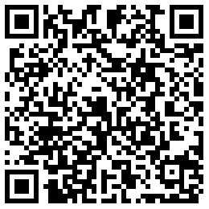

**5、江中_默契大挑战**

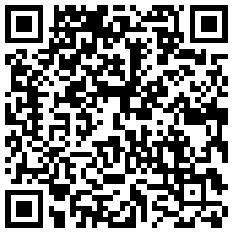

**6、江中_餐桌陪孩子**

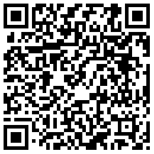

**7、江中_真伪球迷大作战**

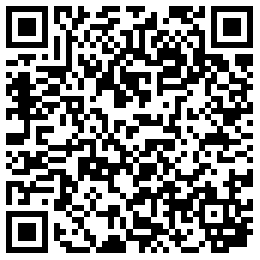

**8、顺丰优选_吃货生存技巧**

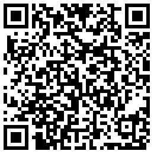

**9、维他奶_维他奶课堂**

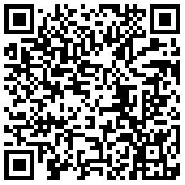

**10、美的_张亮带你寻找菜**

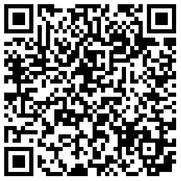

**11、麦凯龙_4K主力出阵**

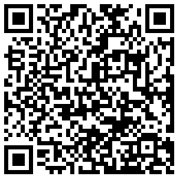

**12、美的_穿越鲜时空**

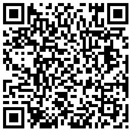

**13、美的_美的冰箱保鲜时代**

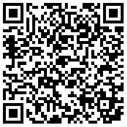

**13、江中_江中美食嗨吃季**

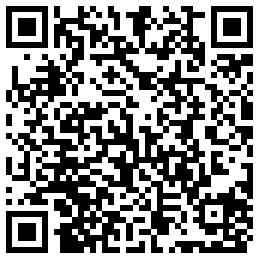

## H5开发详解
#### 第一种，需要获取用户信息的互动型H5
#### 获取微信登陆页
```php
/*    微信登录页 wx_login2.php */

define('IN_ECS', true);
require(dirname(__FILE__) . '/includes/init.php');

$memcache=new Memcache;
$memcache->connect('localhost',33211);

$appid_key="appid_".$_GET[id];

if(!$memcache->get($appid_key)){
	//链接数据库操作
	 $pdo = new PDO('mysql:host=your_hostname;dbname=your_db;charset=utf8', $user, $pass);
	 $sql="select appid from ".table('wx_config')." where id='$_GET[id]'";
     $pdo->prepare($sql);
     $appid=$pdo->execute();
	 $memcache->set($appid_key,$appid,0,86400);
}
else{
     $appid=$memcache->get($appid_key);
}

$back_url=$_GET[url];

$login_url="https://open.weixin.qq.com/connect/oauth2/authorize?appid=$appid&redirect_uri=https://www.xxx.com/wx_oauthe.php&response_type=code&scope=snsapi_userinfo&state=$back_url-$_GET['id']#wechat_redirect";

//echo $memcache->get($appid_key);
//echo $login_url;
header("location:$login_url");
```
>将获取的appid存储在memcached中；可以借鉴，不错的用法。

#### 数据库表格设置,以下数据皆为伪造，只为看清数据库表格的设计(wx_config)
| id | name|appid|secret|token|
|:---:|:---:|:---:|:---:|:---:|
|1|嘉利公关|wxshdfiroijsf99uii|32jndsjgfjfjdkjasdfbn2|12_jdfijjngrgheirn89u34ndc|
|2|酷狗科技|wxshdfiroijsf99uii|32jndsjgfjfjdkjasdfbn2|12_jdfijjngrgheirn89u34ndc|

#### 作为H5开发最为核心的文件一定要引入,用来调用微信的各种借口(jssdk文件)
```php
$mysql_server_name=''; //改成自己的mysql数据库服务器

$mysql_username=''; //改成自己的mysql数据库用户名

$mysql_password=''; //改成自己的mysql数据库密码

$mysql_database=''; //改成自己的mysql数据库名

$conn=mysql_connect($mysql_server_name,$mysql_username,$mysql_password) or die("error connecting") ; //连接数据库

mysql_select_db($mysql_database); //打开数据库
mysql_query("SET NAMES UTF8"); 

class JSSDK {
  private $appId;
  private $appSecret;

  public function __construct($appId, $appSecret) {
    $this->appId = $appId;
    $this->appSecret = $appSecret;
  }

  public function getSignPackage() {
    $jsapiTicket = $this->getJsApiTicket();

    // 注意 URL 一定要动态获取，不能 hardcode.
    $protocol = (!empty($_SERVER['HTTPS']) && $_SERVER['HTTPS'] !== 'off' || $_SERVER['SERVER_PORT'] == 443) ? "https://" : "http://";
    $url = "$protocol$_SERVER[HTTP_HOST]$_SERVER[REQUEST_URI]";

    $timestamp = time();
    $nonceStr = $this->createNonceStr();

    // 这里参数的顺序要按照 key 值 ASCII 码升序排序
    $string = "jsapi_ticket=$jsapiTicket&noncestr=$nonceStr&timestamp=$timestamp&url=$url";

    $signature = sha1($string);

	$string1="1437472252E0o2-at6NcC2OsJiQTlwlPiJcBtWxQ1Nf_w-7oA3LWIhS_mKmgSPbPTUy1sPztNf8MQyKvQWxfDSTZFjtHAnRQabc123456789pN7drt7wWOXBuEnRO0fqHY0sYsdotdi07xy2yFX2uCV3";

	$signature1 = sha1($string1);

    $signPackage = array(
      "appId"     => $this->appId,
      "nonceStr"  => $nonceStr,
      "timestamp" => $timestamp,
      "url"       => $url,
      "signature" => $signature,
      "rawString" => $string,
	  "signature1" => $signature1
    );
    return $signPackage; 
  }

  private function createNonceStr($length = 16) {
    $chars = "abcdefghijklmnopqrstuvwxyzABCDEFGHIJKLMNOPQRSTUVWXYZ0123456789";
    $str = "";
    for ($i = 0; $i < $length; $i++) {
      $str .= substr($chars, mt_rand(0, strlen($chars) - 1), 1);
    }
    return $str;
  }

  private function getJsApiTicket() {
    // jsapi_ticket 应该全局存储与更新，以下代码以写入到文件中做示例，自己创建该文件名吧
    $data = json_decode(file_get_contents("../jsapi_ticket.json"));
    if ($data->expire_time < time()) {
      $accessToken = $this->getAccessToken();
      // 如果是企业号用以下 URL 获取 ticket
      // $url = "https://qyapi.weixin.qq.com/cgi-bin/get_jsapi_ticket?access_token=$accessToken";
      $url = "https://api.weixin.qq.com/cgi-bin/ticket/getticket?type=jsapi&access_token=$accessToken";
      $res = json_decode($this->httpGet($url));
      $ticket = $res->ticket;
      if ($ticket) {
        $data->expire_time = time() + 7000;
        $data->jsapi_ticket = $ticket;
        $fp = fopen("../jsapi_ticket.json", "w");
        fwrite($fp, json_encode($data));
        fclose($fp);
      }
    } else {
      $ticket = $data->jsapi_ticket;
    }
    return $ticket;
  }

  public function getAccessToken() {
    // access_token 应该全局存储与更新，以下代码以写入到文件中做示例
    $sql=mysql_query("select * from active_wx_config where appid='$this->appId'");
	$info=mysql_fetch_array($sql);
	$nowtime=time();
	$surpluses_time=$nowtime-$info[update_time];
	if($surpluses_time>800){
		$url = "https://api.weixin.qq.com/cgi-bin/token?grant_type=client_credential&appid=$this->appId&secret=$this->appSecret";
        $res = json_decode($this->httpGet($url));
        $access_token = $res->access_token;
		$sql=mysql_query("update active_wx_config set token='$access_token',update_time='$nowtime' where appid='$this->appId'");
	}
	else{
	   $access_token=$info[token];
	}
    return $access_token;
  }

  private function httpGet($url) {
    $curl = curl_init();
    curl_setopt($curl, CURLOPT_RETURNTRANSFER, true);
    curl_setopt($curl, CURLOPT_TIMEOUT, 500);
    curl_setopt($curl, CURLOPT_SSL_VERIFYPEER, false);
    curl_setopt($curl, CURLOPT_SSL_VERIFYHOST, false);
    curl_setopt($curl, CURLOPT_URL, $url);

    $res = curl_exec($curl);
    curl_close($curl);

    return $res;
  }
}
//配置自己公众号的appid和secret
$jssdk = new JSSDK("", "");
$signPackage = $jssdk->GetSignPackage();
//$signPackage = $jssdk->getAccessToken();
//print_r($signPackage);
//$json=json_encode($signPackage);
```
### 因此正式的需要获取用户信息的H5开发头部必须加上以下代码：
```php
require_once "jssdk1.php";
 if(!$_COOKIE['openid']){
     header("location:./wx_login2.php?id=6&url=https://www.xxx.com/h5/xxx/index.php");
     die();
 }
```

### 微信分享借口的调用(详说)
```
<!--微信分享start-->
<script src="https://res.wx.qq.com/open/js/jweixin-1.0.0.js"></script>
<script>
        var appid,timestamp,nonceStr,signature,jsApiList;
        var openid="<?php echo $_COOKIE['openid']; ?>";
        var nickname="<?php echo $_COOKIE['nickname']; ?>";
        var headimgurl="<?php echo $_COOKIE['headimgurl']; ?>";

                wx.config({
                    debug: false,
                    appId: '<?php echo $signPackage["appId"];?>',
                    timestamp: <?php echo $signPackage["timestamp"];?>,
                    nonceStr: '<?php echo $signPackage["nonceStr"];?>',
                    signature: '<?php echo $signPackage["signature"];?>',
                    jsApiList: [
                        'checkJsApi',
                        'onMenuShareTimeline',
                        'onMenuShareAppMessage',
                        'onMenuShareQQ',
                        'onMenuShareWeibo',
                        'chooseImage',
                        'previewImage',
                        'uploadImage',
                        'downloadImage'
                     ]
            });

            wx.ready(function(){

                var title = '';      //分享标题
                var desc = '';       //分享描述
                var desc1 = '';      //分享描述
                var imgurl = '';     //分享图片
                var shareurl='';     //分享链接
                var link_url="";     //分享完跳转链接

                wx.onMenuShareTimeline({

                    title: desc1,
                    link: shareurl,
                    imgUrl: imgurl,
                    trigger: function (res) {
                       //alert('用户点击分享到朋友圈');
                    },
                    success: function (res) {
                       // _hmt.push(['_trackEvent', 'sharewx', 'fxcg', '']);
                       // window.location.href = link_url;

                    },
                    cancel: function (res) {
                    //alert('已取消');
                    },
                    fail: function (res) {
                    //alert(JSON.stringify(res));
                    }
                });
                wx.onMenuShareAppMessage({
                    title: title, // 分享标题
                    desc: desc, // 分享描述
                    link: shareurl, // 分享链接
                    imgUrl: imgurl, // 分享图标
                    type: '', // 分享类型,music、video或link，不填默认为link
                    dataUrl: '', // 如果type是music或video，则要提供数据链接，默认为空
                    success: function () { 
                        // 用户确认分享后执行的回调函数
                        // _hmt.push(['_trackEvent', 'sharewx', 'fxcg', '']);
                        // window.location.href = link_url;
                    },
                    cancel: function () { 
                        // 用户取消分享后执行的回调函数
                    }
                });
                wx.onMenuShareQQ({
                    title: title, // 分享标题
                    desc: desc, // 分享描述
                    link: shareurl, // 分享链接
                    imgUrl: imgurl, // 分享图标
                    success: function () { 
                       // 用户确认分享后执行的回调函数
                       // window.location.href = link_url;
                    },
                    cancel: function () { 
                       // 用户取消分享后执行的回调函数
                    }
                });
                wx.onMenuShareWeibo({
                    title: title, // 分享标题
                    desc: desc, // 分享描述
                    link: shareurl,// 分享链接
                    imgUrl: imgurl, // 分享图标
                    success: function () {
                       // 用户确认分享后执行的回调函数
                       // window.location.href = link_url;
                    },
                    cancel: function () {
                        // 用户取消分享后执行的回调函数
                    }
                });

                //wx.hideOptionMenu();

        });
            wx.error(function(res){
                //alert(res+"111");
            });

</script>
    <!-- 微信分享end -->
```
#### 其他借口请查看微信官方的API,第二种展示型的H5，只要在头部引入jssdk文件就行，不需要进行下面的cookie判断。请下载本人在公司所完成并上线的H5,里面有各种各样的好玩的功能，比如调取摄像机，画图合成，音视频的播放暂停，录音等等。
